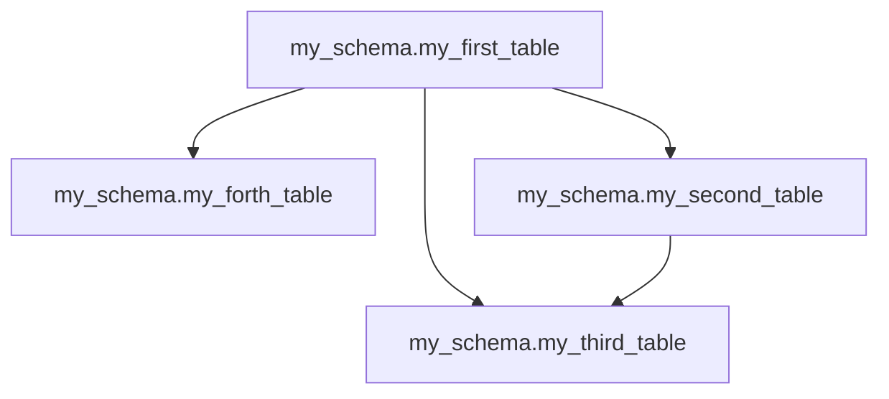

# Dependency Graph Report

## Overview

This report provides a comprehensive analysis of the SQL model dependencies.

## Statistics

- **Total Tables**: 4
- **Total Dependencies**: 4
- **Circular Dependencies**: 0

## Visual Diagram

## Execution Order

1. `my_schema.my_first_table`
2. `my_schema.my_forth_table`
3. `my_schema.my_second_table`
4. `my_schema.my_third_table`

## Table Details

### `my_schema.my_first_table`

**No dependencies** (base table)

**Used by**: `my_schema.my_third_table`, `my_schema.my_forth_table`, `my_schema.my_second_table`

### `my_schema.my_forth_table`

**Depends on**: `my_schema.my_first_table`

**No dependents** (leaf table)

### `my_schema.my_second_table`

**Depends on**: `my_schema.my_first_table`

**Used by**: `my_schema.my_third_table`

### `my_schema.my_third_table`

**Depends on**: `my_schema.my_first_table`, `my_schema.my_second_table`

**No dependents** (leaf table)

---

*Generated by Project Parser*