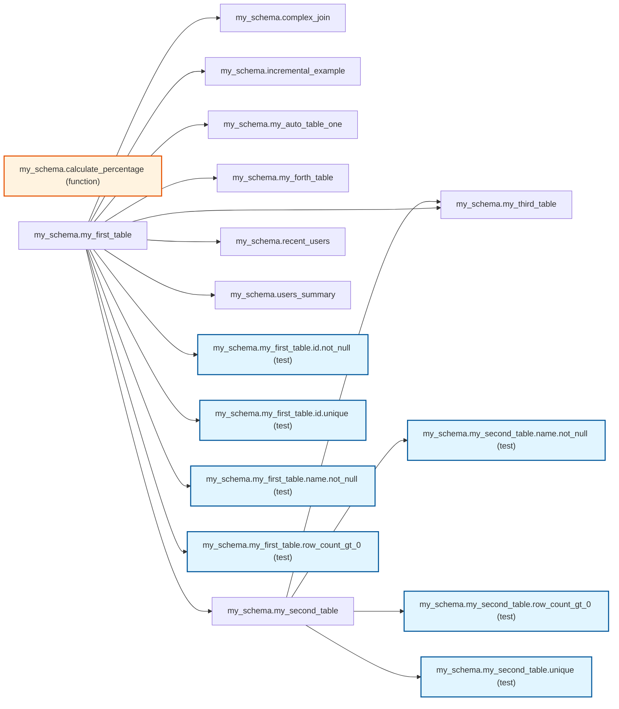

# Dependency Graph Report

## Overview

This report provides a comprehensive analysis of the SQL model dependencies.

## Statistics

- **Total Tables**: 9
- **Total Functions**: 1
- **Total Tests**: 7
- **Total Nodes**: 17
- **Total Dependencies**: 16
- **Circular Dependencies**: 0
## Visual Diagram

## Execution Order

1. `my_schema.calculate_percentage`
2. `my_schema.my_first_table`
3. `my_schema.users_summary`
4. `my_schema.recent_users`
5. `my_schema.complex_join`
6. `my_schema.incremental_example`
7. `my_schema.my_auto_table_one`
8. `my_schema.my_second_table`
9. `my_schema.my_forth_table`
10. `test:my_schema.my_first_table.id.not_null`
11. `test:my_schema.my_first_table.id.unique`
12. `test:my_schema.my_first_table.name.not_null`
13. `test:my_schema.my_first_table.row_count_gt_0`
14. `my_schema.my_third_table`
15. `test:my_schema.my_second_table.name.not_null`
16. `test:my_schema.my_second_table.row_count_gt_0`
17. `test:my_schema.my_second_table.unique`

## Tests Details

The following tests are defined and integrated into the dependency graph:

### my_schema.my_first_table.id.not_null

**Type**: Test

**Depends on tables**: `my_schema.my_first_table`

**No dependents**

### my_schema.my_first_table.id.unique

**Type**: Test

**Depends on tables**: `my_schema.my_first_table`

**No dependents**

### my_schema.my_first_table.name.not_null

**Type**: Test

**Depends on tables**: `my_schema.my_first_table`

**No dependents**

### `row_count_gt_0` on `my_schema.my_first_table`

**Type**: Column-level

**Depends on tables**: `my_schema.my_first_table`

**No dependents**

### my_schema.my_second_table.name.not_null

**Type**: Test

**Depends on tables**: `my_schema.my_second_table`

**No dependents**

### `row_count_gt_0` on `my_schema.my_second_table`

**Type**: Column-level

**Depends on tables**: `my_schema.my_second_table`

**No dependents**

### `unique` on `my_schema.my_second_table`

**Type**: Column-level

**Depends on tables**: `my_schema.my_second_table`

**No dependents**

## Transformation Details

### `my_schema.calculate_percentage`

**Type**: Function

**No dependencies** (base function)

**No dependents** (leaf function)

### `my_schema.complex_join`

**Type**: Table

**Depends on**: `my_schema.my_first_table`

**No dependents** (leaf table)

### `my_schema.incremental_example`

**Type**: Table

**Depends on**: `my_schema.my_first_table`

**No dependents** (leaf table)

### `my_schema.my_auto_table_one`

**Type**: Table

**Depends on**: `my_schema.my_first_table`

**No dependents** (leaf table)

### `my_schema.my_first_table`

**Type**: Table

**No dependencies** (base table)

**Used by**: `my_schema.users_summary`, `my_schema.recent_users`, `my_schema.complex_join`, `my_schema.incremental_example`, `my_schema.my_auto_table_one`, `my_schema.my_second_table`, `my_schema.my_forth_table`, `my_schema.my_third_table`

**Tested by**: `my_schema.my_first_table.id.not_null`, `my_schema.my_first_table.id.unique`, `my_schema.my_first_table.name.not_null`, `my_schema.my_first_table.row_count_gt_0`

### `my_schema.my_forth_table`

**Type**: Table

**Depends on**: `my_schema.my_first_table`

**No dependents** (leaf table)

### `my_schema.my_second_table`

**Type**: Table

**Depends on**: `my_schema.my_first_table`

**Used by**: `my_schema.my_third_table`

**Tested by**: `my_schema.my_second_table.name.not_null`, `my_schema.my_second_table.row_count_gt_0`, `my_schema.my_second_table.unique`

### `my_schema.my_third_table`

**Type**: Table

**Depends on**: `my_schema.my_second_table`, `my_schema.my_first_table`

**No dependents** (leaf table)

### `my_schema.recent_users`

**Type**: Table

**Depends on**: `my_schema.my_first_table`

**No dependents** (leaf table)

### `my_schema.users_summary`

**Type**: Table

**Depends on**: `my_schema.my_first_table`

**No dependents** (leaf table)

---

*Generated by Project Parser*