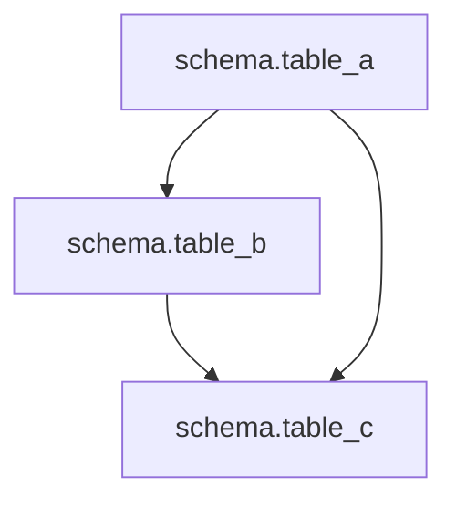

# Dependency Graph Report

## Overview

This report provides a comprehensive analysis of the SQL model dependencies.

## Statistics

- **Total Tables**: 3
- **Total Dependencies**: 3
- **Circular Dependencies**: 0

## Visual Diagram

## Execution Order

1. `schema.table_a`
2. `schema.table_b`
3. `schema.table_c`

## Table Details

### `schema.table_a`

**No dependencies** (base table)

**Used by**: `schema.table_b`, `schema.table_c`

### `schema.table_b`

**Depends on**: `schema.table_a`

**Used by**: `schema.table_c`

### `schema.table_c`

**Depends on**: `schema.table_b`, `schema.table_a`

**No dependents** (leaf table)

---

*Generated by Project Parser*